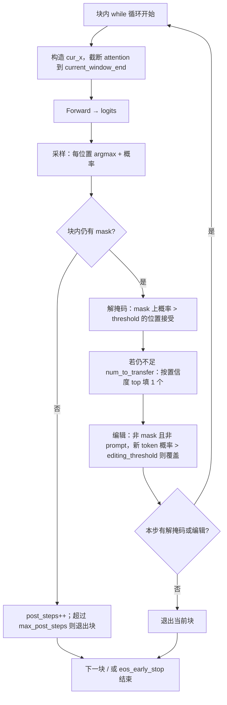
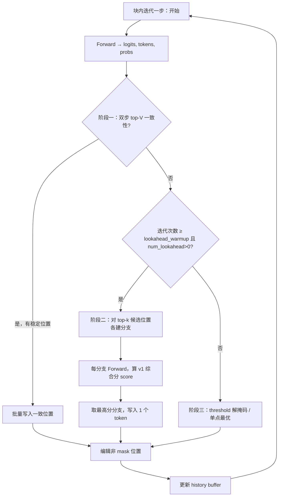
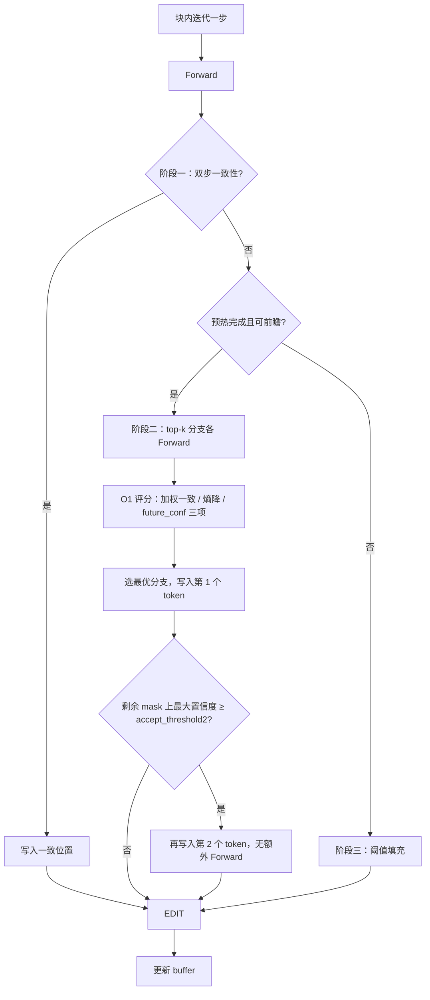
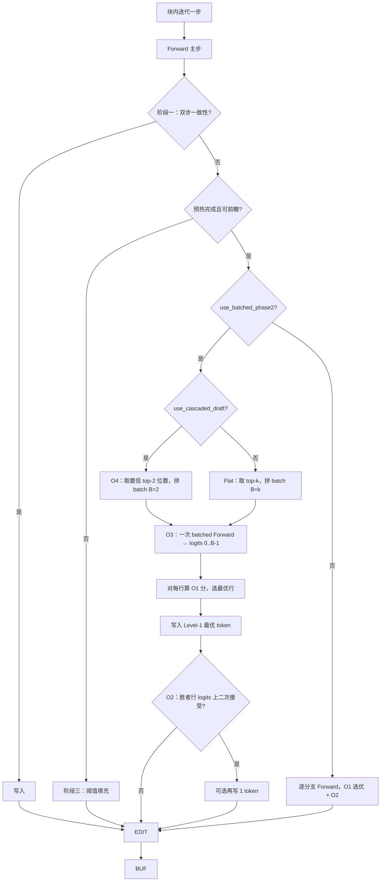

# 解码策略流程图（Mermaid）

本文用 Mermaid 图概括 **Baseline（LLaDA2.1-mini 原生 `generate`）** 与 **CLAD v1 / v2 / v3** 在「单块内一步迭代」层面的控制流差异。  
渲染：GitHub / VS Code Markdown 预览 / Typora 等支持 Mermaid 的编辑器均可显示。

---

## 1. Baseline（原生 `generate`，块内迭代）

与 `design.md` §1.3 一致：每轮一次 forward，再解掩码与编辑。

**外层**：按块顺序遍历；块间块对角因果 mask。每块结束后可检查 EOS 提前结束整段生成。

---

## 2. CLAD v1（`llada_clad_decode.py`）

在 Baseline 的「单轮」中插入：**阶段一** 双步一致性快通道 → **阶段二** 一致性传播前瞻 → **阶段三** 阈值填充；编辑与 buffer 更新与原生一致。

**说明**：`consistency_prop` 为「填入后剩余 mask 上新 argmax 与填前一致」的比例（v1 为**均匀**权重）。

---

## 3. CLAD v2（`llada_clad_v2_decode.py` 设计 / 与 v3 共用 O1·O2 公式）

在 v1 骨架上，**阶段二** 分支评分改为 **O1** 三项加权；阶段二结束后增加 **O2**（复用最优分支 logits，可能再接受 1 个 token）。

**说明**：若仓库中 v2 实现与 v3 共用同一套 `_clad_branch_score_v2` / O2，则上图与 v3 的「单分支串行 Phase-2」等价；v3 主要把 Phase-2 的多分支 **Forward 合并为 batch（O3）**。

---

## 4. CLAD v3（`llada_clad_v3_decode.py`）

继承 v2 的 **O1 / O2**；**阶段二** 默认用 **O3 批量 forward**，并用 **O4** 约束 Level-1 仅比较 top-2 位置（或关闭 O4 时比较 top-k）。

---

## 5. 对照：四种策略「单步迭代」前向次数（示意）

| 策略 | 典型每迭代主 forward | Phase-2 额外 forward（示意） |
|------|----------------------|------------------------------|
| Baseline | 1 | 0 |
| CLAD v1 | 1 | 0～k（串行 k 次分支） |
| CLAD v2 | 1 | 同 v1（实现为串行时） |
| CLAD v3 | 1 | **0～1 次 batched**（替代 k 次串行） |

实际次数取决于是否命中阶段一、mask 数量及 `use_batched_phase2` 等；上表仅表达相对关系。

---

## 6. 源码索引

| 策略 | 主要文件 |
|------|----------|
| Baseline | `modeling_llada2_moe.py` → `generate()` |
| CLAD v1 | `dlm/src/llada_clad_decode.py` |
| CLAD v2 | `dlm/src/llada_clad_v2_decode.py` |
| CLAD v3 | `dlm/src/llada_clad_v3_decode.py` |

更细的设计说明见 `dlm/docs/design.md`（§1.3、§1.9–§1.11）。
